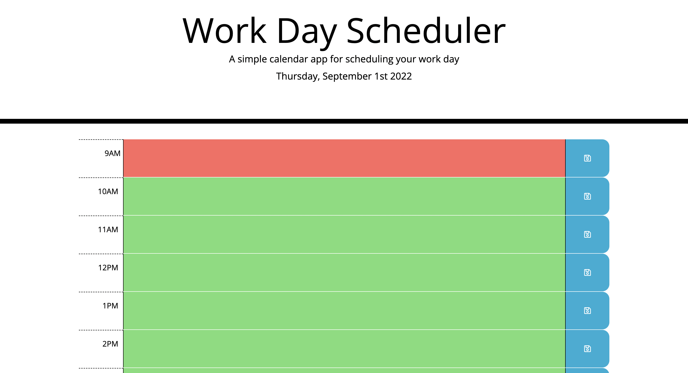
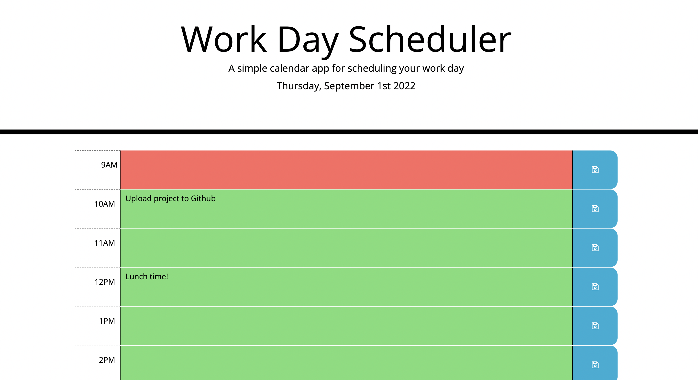
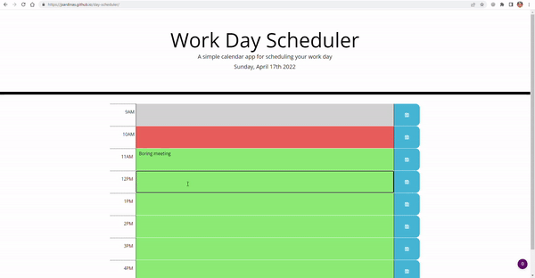

# Day Scheduler

[Calendar app](https://lcortes0801.github.io/day-scheduler/) that allows a user to save events for each hour of the day.

## Getting Started

This is a simple calendar app. Click on any future timeslot to enter an activity and the use the save button to permanently save the timeslot. Past timeslots cannot be modified. 

## Implementation

The page is generated mostly with JavaScript and jQuery. When the document loads, all timeslots from 9 AM to 6 PM are generated and assigned a class depending on the current time. The stored data will be read to fill previously saved events.

### Update
A function will run every hour to update the UI, setting the current timeslot to past and the next one to present. Also, if the page is active at midnight, it will reload and destroy the previously saved data.

